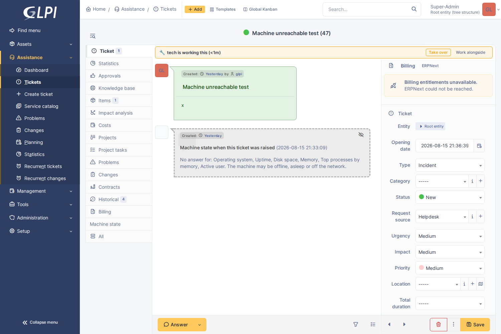

# GLPI Presence

Collision detection and live presence for technicians on GLPI ITIL objects. Who
else has this ticket open, who is typing right now, and who has picked the work
up.



## Compared to core's ObjectLock

| | `ObjectLock` (core) | This plugin |
|---|---|---|
| Model | Pessimistic, exclusive | Advisory, informational |
| Holders | Exactly one (`UNIQUE (itemtype, items_id)`) | Any number of participants |
| Effect on others | Forced into a read-only profile | None; never blocks |
| Granularity | Locked / not locked | Viewing vs typing vs claimed |
| Recovery | Cron sweep measured in hours | Seconds (TTL), plus explicit leave |
| Default | Off, opt-in per itemtype | On for Ticket/Change/Problem |

The two coexist. Core locking enforces; this one informs.

## Features

- **Presence** — who else has the item open, one entry per person. Two tabs
  show once.
- **Typing** — who is composing a reply, task or solution, with a pulsing
  indicator that decays on its own, so a crashed browser leaves no ghost.
- **Soft claim** — a voluntary "I'm working this". Others see the holder and are
  offered Take over or Work alongside. Nobody is blocked. Claims expire on
  inactivity rather than disconnect.
- **`who_is_on_it`** read-only tool for `glpiai`: viewers, typists and the claim
  holder. Claiming is not offered as a tool — a claim asserts that a named
  person is doing the work.

Technician (central) interface only. Requesters never see presence and their own
presence is never reported.

## Install

```bash
# from the GLPI root
git clone https://github.com/bijstaan/glpi-presence.git plugins/glpipresence
php bin/console plugin:install -u glpi glpipresence
php bin/console plugin:activate glpipresence
```

## Settings

**Setup → Plugins → GLPI Presence.**

| Setting | Default | Notes |
|---|---|---|
| Itemtypes | Ticket, Change, Problem | Where the bar appears |
| Heartbeat (focused) | 8s | Must stay under the typing TTL |
| Heartbeat (background) | 45s | Backgrounded tabs cost far less |
| Presence TTL | 90s | When a silent technician is treated as gone |
| Typing TTL | 12s | How fast "is typing" fades |
| Claim enabled | yes | Off for presence only |
| Claim idle TTL | 30m | Inactivity before a claim is released |

Contradictory values are reconciled rather than rejected: a bad number degrades
to the nearest workable one instead of taking presence down.

**The focused heartbeat must be shorter than the typing TTL.** Presence is a
sampling system — poll every 15s with a 12s typing TTL and a colleague can type
a whole sentence between two polls unobserved. `Settings::reconcile()` enforces
this by raising the typing TTL if the heartbeat is slow; a fast heartbeat is the
better fix.

Polls go hot (4s) for 20s whenever someone else is typing.

## How it works

GLPI 11 has no WebSocket or SSE channel, and a long-lived PHP request per open
ticket would pin an FPM worker each, so this polls.

```
browser (public/js/presence.js)
   │  POST ajax/presence.php   {heartbeat|leave|claim|takeover|release}
   ▼
Presence  ── glpi_plugin_glpipresence_presence   (one row per browser tab)
Claim     ── glpi_plugin_glpipresence_claims     (one row per item)
   ▲
GarbageCollector (cron, 5m)  +  sampled sweep on ~1 in 20 heartbeats
```

- Times are stored as unix integers, not SQL `TIMESTAMP`. Expiry is computed in
  PHP, and mixing PHP's clock with MySQL's `CURRENT_TIMESTAMP` makes presence
  wrong whenever the two disagree on timezone.
- Departure is reported with a `keepalive` fetch on `pagehide`, so closing a tab
  removes you immediately. `sendBeacon` is a fallback only: it cannot set
  headers, and headers are what keep the CSRF token on the preserving path.
- **CSRF.** GLPI 11 validates in the kernel and treats transports differently —
  an XHR header token (`X-Glpi-Csrf-Token`) is *preserved*, a POST body token is
  *consumed*. A heartbeat every 8s consuming tokens would empty the session pool
  within minutes and break unrelated forms in other tabs. The client always
  sends the header form, and the endpoint does not re-check, since a second
  check would reject every request whose token the kernel just consumed.

## API

The same three actions over the high-level API, for `glpimobile`. Every route
re-authorises against the addressed item: reading takes read access, claiming
takes write access. Central interface only.

| Method | Path | Purpose |
| --- | --- | --- |
| `GET` | `/GlpiPresence/item/{itemtype}/{items_id}` | who is here, and who holds the claim |
| `POST` | `/GlpiPresence/item/{itemtype}/{items_id}/heartbeat` | "I am here", optionally "I am typing" |
| `POST` | `/GlpiPresence/item/{itemtype}/{items_id}/leave` | stop being here |
| `POST` | `/GlpiPresence/item/{itemtype}/{items_id}/claim` | claim the work (409 when held) |
| `POST` | `/GlpiPresence/item/{itemtype}/{items_id}/takeover` | take an existing claim |
| `POST` | `/GlpiPresence/item/{itemtype}/{items_id}/release` | hand it back |

Every route answers with the same state object — `server_time`, `you`,
`can_claim`, `presence_ttl`, `participants`, `claim` — so a client that lost a
race re-renders from the truth. `server_time` is included because "claimed 40
minutes ago" is computed from this server's timestamps and a phone's clock may
be an hour out.

The app beats more slowly than the browser by design: a phone screen is off most
of the time and radio wake-ups cost battery. Presence expires on `presence_ttl`
regardless, so a slow client appears and disappears more coarsely.

Feature discovery goes through glpimobile's `glpimobile_capabilities` hook:
`presence` (a central-interface session) and `claim` (soft claims on).

## Tests

```bash
cd tests/browser && node presence-check.js
```

Drives two real technicians through the whole lifecycle: both arriving, typing,
claiming, taking over and leaving.

## Limitations

- Taking a claim is silent; the previous holder finds out by looking.
- Claims are not written to the item's Historical tab.

## Licence

GPL-3.0-or-later, the same licence as GLPI. The plugin is loaded into GLPI's
process and extends its classes, so it is a derivative work. See
[LICENSE](LICENSE).
